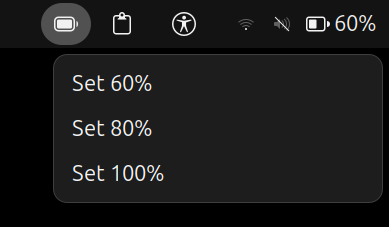

# Battery Limit CLI (Linux)

Battery Limit CLI is a lightweight utility for controlling battery charging limits on Linux laptops that support charge threshold management.

It allows users to stop charging at 60%, 80%, or 100%, helping improve long-term battery health and reduce battery wear.

An approved GNOME Shell extension is also available, providing a graphical interface directly from the GNOME top panel.

## Features

* Set battery charge limits to 60%, 80%, or 100%
* Display current battery status and configured charge limit
* Automatically detects BAT0 and BAT1
* Includes safety checks for unsupported systems
* Simple command-line interface
* GNOME Shell extension integration
* Lightweight and dependency-free

## GNOME Shell Extension

The project includes an officially approved GNOME Shell extension that allows battery charge limits to be changed directly from the GNOME panel.

Features:

* One-click charge limit selection (60%, 80%, 100%)
* Secure authentication using `pkexec`
* Native GNOME Shell integration
* Minimal and lightweight user interface

GNOME Extension:

https://extensions.gnome.org/extension/9584/battery-limit/

## Screenshot



## Repository Structure

```text
battery-limit-cli/
├── extension/
│   └── battery-limit@aditya/
│       ├── extension.js
│       └── metadata.json
├── assets/
│   └── gnome-menu.png
├── battery
├── battery-limit.zip
├── LICENSE
└── README.md
```

## Requirements

Your system must expose the following interface:

```text
/sys/class/power_supply/BAT*/charge_control_end_threshold
```

If this file does not exist, battery charge limiting is not supported and the tool will not function.

## Installation

### Option 1: Install Using the Debian Package

Download the latest release from GitHub Releases and install it:

```bash
sudo dpkg -i battery-limit_1.0_all.deb
```

### Option 2: Manual Installation

```bash
git clone https://github.com/aditya-git0503/battery-limit-cli.git
cd battery-limit-cli

sudo cp battery /usr/local/bin/battery
sudo chmod +x /usr/local/bin/battery
```

## Usage

### Set Charge Limit

```bash
battery 60
battery 80
battery 100
```

### Check Battery Status

```bash
battery status
```

## Example Output

```text
Battery Status:
Current Limit: 80%
Charging State: Not charging
Battery Level: 76%
```

## Installing the GNOME Extension

### From GNOME Extensions

Install directly from:

https://extensions.gnome.org/extension/9584/battery-limit/

### Manual Installation

```bash
mkdir -p ~/.local/share/gnome-shell/extensions/

cp -r extension/battery-limit@aditya \
~/.local/share/gnome-shell/extensions/

gnome-extensions enable battery-limit@aditya
```

## Permissions

Changing battery charge limits requires elevated privileges.

The CLI tool and GNOME extension use `pkexec` to securely request administrator authentication before modifying system battery settings.

A system password prompt will appear when applying a new charge limit.

## Tested On

* ASUS Vivobook S14 (i7-13620H)
* Ubuntu 24.04.4 LTS
* GNOME Shell 46

## Notes

* Changes take effect immediately
* If the current battery level exceeds the selected limit, charging will pause until the battery level falls below the configured threshold
* Hardware support varies by manufacturer and model
* Not all Linux laptops expose battery charge threshold controls

## Future Improvements

* Live battery percentage display in the GNOME panel
* Dynamic battery icon updates
* Improved support for additional hardware vendors
* Better handling of unsupported systems

## Contributing

Issues, feature requests, and pull requests are welcome.

## License

MIT License
